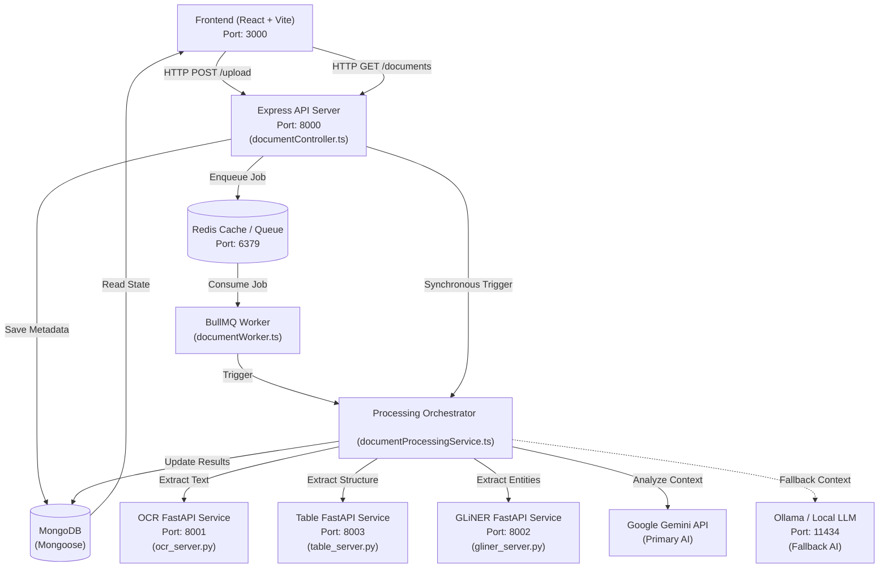

# Smart Document Vault Architecture Diagram

```mermaid
flowchart TD
    %% Define Nodes
    Client["Frontend (React + Vite) \n Port: 3000"]
    API["Express API Server \n Port: 8000 \n (documentController.ts)"]
    DB[("MongoDB \n (Mongoose)")]
    Redis[("Redis Cache / Queue \n Port: 6379")]
    Worker["BullMQ Worker \n (documentWorker.ts)"]
    Orchestrator["Processing Orchestrator \n (documentProcessingService.ts)"]
    
    %% AI & OCR Microservices
    OCR["OCR FastAPI Service \n Port: 8001 \n (ocr_server.py)"]
    Table["Table FastAPI Service \n Port: 8003 \n (table_server.py)"]
    GLiNER["GLiNER FastAPI Service \n Port: 8002 \n (gliner_server.py)"]
    
    %% External APIs & Fallbacks
    Gemini["Google Gemini API \n (Primary AI)"]
    Ollama["Ollama / Local LLM \n Port: 11434 \n (Fallback AI)"]

    %% Edges / Connections
    Client -->|HTTP POST /upload| API
    Client -->|HTTP GET /documents| API
    
    API -->|Save Metadata| DB
    API -->|Enqueue Job| Redis
    
    Redis -->|Consume Job| Worker
    Worker -->|Trigger| Orchestrator
    API -->|Synchronous Trigger| Orchestrator
    
    Orchestrator -->|Extract Text| OCR
    Orchestrator -->|Extract Structure| Table
    Orchestrator -->|Extract Entities| GLiNER
    
    Orchestrator -->|Analyze Context| Gemini
    Orchestrator -.->|Fallback Context| Ollama
    
    Orchestrator -->|Update Results| DB
    DB -->|Read State| Client
```
