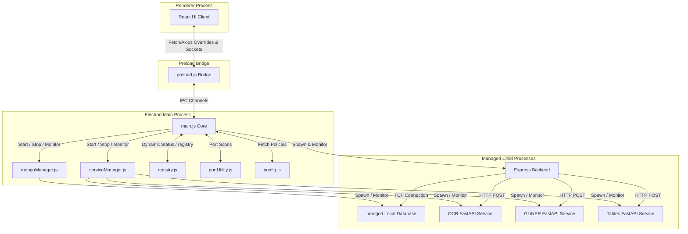
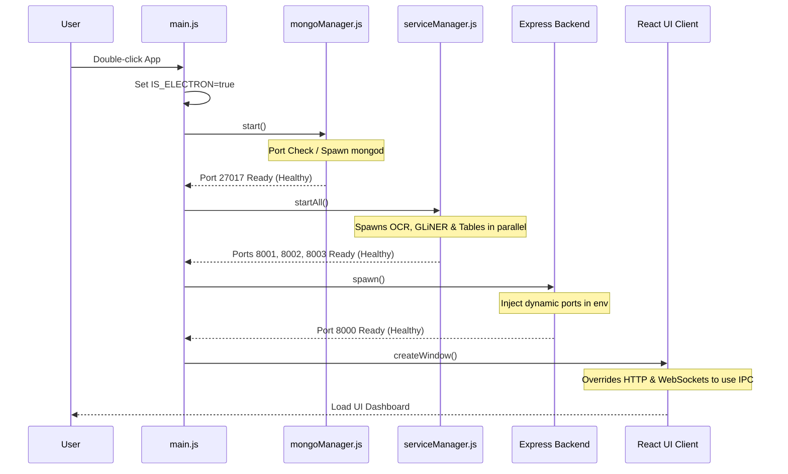
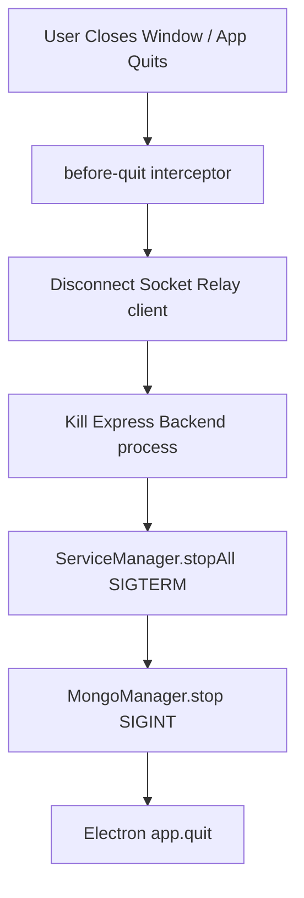
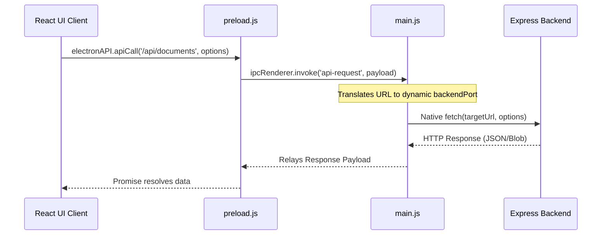
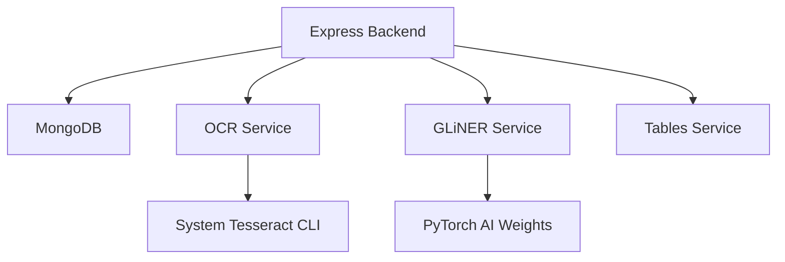
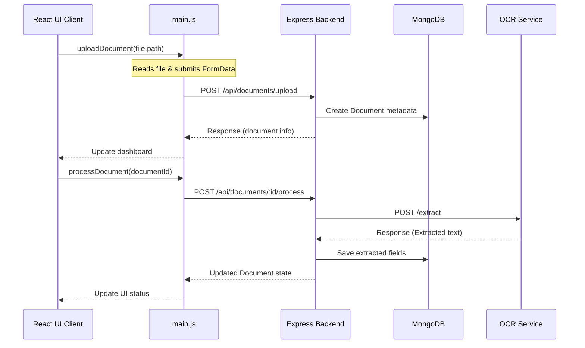

# Smart Document Vault: Electron Architecture & Design Reference

This document serves as the complete technical architecture and developer onboarding guide for the Electron desktop wrapper integration of the Smart Document Vault.

---

## 1. High Level Architecture

The application transitions the MERN + Python web stack into a single-execution offline desktop app. Electron supervises every background service as a managed child process.



### Component Responsibilities

| Component | Responsibility |
| :--- | :--- |
| **Electron Main Process** | Serves as the central operating system bridge, supervises service configurations, manages window states, maps dynamic ports, and handles global shutdowns. |
| **Renderer Process** | Renders React + Vite UI. Intercepts all fetch/axios requests and tunnels them over IPC, completely isolated from ports and backend configuration. |
| **Preload Bridge** | Establishes a secure `contextBridge` boundary between the Node.js runtime and the browser environment. Exposes selective IPC invocation methods to `window.electronAPI`. |
| **MongoDB Manager** | Relocates DB files into writable AppData folders, runs local `mongod` servers, monitors crashes, and triggers restarts. |
| **Service Manager** | A generic, configuration-driven process manager that registers, spawns, and health-checks independent FastAPI services. Handles linear backoff crash-loop recoveries. |
| **Express Backend** | Houses business logic, file upload routes, database models, and queues. Spawns under Electron's environment variables (such as dynamic ports). |
| **Python AI Microservices** | Handle machine learning inference (OCR extraction, GLiNER entity extraction, table sheet calculations) as independent REST services. |

---

## 2. Project Structure

All files relating to desktop wrapper processes reside in the dedicated [electron/](file:///Users/partht/Downloads/auto-file-ai_-smart-document-vault/electron) workspace directory:

```
electron/
├── bin/                   <-- Local directory for bundled platform binaries (mongod, python, etc.)
├── config.js              <-- Central startup policies & service parameters
├── main.js                <-- Bootloader orchestrator & IPC bridge handlers
├── mongoManager.js        <-- Dedicated process manager for the MongoDB binary
├── package.json           <-- Node configurations & dependencies (socket.io-client, dotenv)
├── portUtility.js         <-- Port occupancy checks & process health verifications
├── preload.js             <-- Secure contextBridge exposing API IPC callbacks
├── registry.js            <-- Central registry for dynamic service configurations
└── serviceManager.js      <-- Generic supervision class for Python AI processes
```

### File Technical Profiles

#### [package.json](file:///Users/partht/Downloads/auto-file-ai_-smart-document-vault/electron/package.json)
* **Purpose**: Declares workspace metadata, execution scripts, and desktop dependencies.
* **Dependencies**: `dotenv`, `socket.io-client`.
* **Important Scripts**: `npm start` (boots `electron .`).

#### [config.js](file:///Users/partht/Downloads/auto-file-ai_-smart-document-vault/electron/config.js)
* **Purpose**: Centralizes service definitions, execution modules, health configurations, and restart policies.
* **Dependencies**: None.
* **Important Exports**: `services` mapping object.

#### [registry.js](file:///Users/partht/Downloads/auto-file-ai_-smart-document-vault/electron/registry.js)
* **Purpose**: Maintains an in-memory runtime registry of active process IDs, ports, status indicators, and handles.
* **Dependencies**: None.
* **Important Class**: `ServiceRegistry`.
* **Important Functions**: `update(key, updates)`, `get(key)`, `getAll()`.

#### [portUtility.js](file:///Users/partht/Downloads/auto-file-ai_-smart-document-vault/electron/portUtility.js)
* **Purpose**: Conducts low-level TCP connection checks, detects port collisions, and verifies process health signatures.
* **Dependencies**: Native `net`, `http` modules.
* **Important Functions**: `isPortInUse(port)`, `checkHttpServiceHealth(port, healthPath, expectedStatus, expectedJson)`, `checkMongoPort(port)`.

#### [mongoManager.js](file:///Users/partht/Downloads/auto-file-ai_-smart-document-vault/electron/mongoManager.js)
* **Purpose**: Spawns and manages the local MongoDB community database instance.
* **Dependencies**: [config.js](file:///Users/partht/Downloads/auto-file-ai_-smart-document-vault/electron/config.js), [registry.js](file:///Users/partht/Downloads/auto-file-ai_-smart-document-vault/electron/registry.js), [portUtility.js](file:///Users/partht/Downloads/auto-file-ai_-smart-document-vault/electron/portUtility.js), native `child_process`.
* **Important Class**: `MongoManager`.
* **Important Functions**: `start()`, `pollHealth()`, `handleExit()`, `stop()`.

#### [serviceManager.js](file:///Users/partht/Downloads/auto-file-ai_-smart-document-vault/electron/serviceManager.js)
* **Purpose**: A generic, reusable process manager that spawns, health-polls, and recovers registered Python microservices.
* **Dependencies**: [registry.js](file:///Users/partht/Downloads/auto-file-ai_-smart-document-vault/electron/registry.js), [portUtility.js](file:///Users/partht/Downloads/auto-file-ai_-smart-document-vault/electron/portUtility.js), native `child_process`, `http`.
* **Important Class**: `ServiceManager`.
* **Important Functions**: `register(key, config)`, `startService(key)`, `startAll()`, `pollHealth()`, `handleExit()`, `stopService(key)`, `stopAll()`, `getDiagnostics()`.
* **Future Extension**: New AI microservices are registered via config parameters without changing this code.

#### [preload.js](file:///Users/partht/Downloads/auto-file-ai_-smart-document-vault/electron/preload.js)
* **Purpose**: Exposes secure communication callbacks to the frontend window context.
* **Dependencies**: `electron`.
* **Exposed API (`window.electronAPI`)**: `apiCall()`, `socketOn()`, `socketOff()`, `socketDisconnect()`, `onSocketEvent()`, `removeSocketListener()`, `getServiceDiagnostics()`, `restartService()`, `stopService()`, `getServiceLogs()`, `getAppVersion()`.

#### [main.js](file:///Users/partht/Downloads/auto-file-ai_-smart-document-vault/electron/main.js)
* **Purpose**: Boots the system services in dependency order, coordinates IPC channels, and binds shutdown triggers.
* **Dependencies**: `electron`, [config.js](file:///Users/partht/Downloads/auto-file-ai_-smart-document-vault/electron/config.js), [registry.js](file:///Users/partht/Downloads/auto-file-ai_-smart-document-vault/electron/registry.js), [portUtility.js](file:///Users/partht/Downloads/auto-file-ai_-smart-document-vault/electron/portUtility.js), [mongoManager.js](file:///Users/partht/Downloads/auto-file-ai_-smart-document-vault/electron/mongoManager.js), [serviceManager.js](file:///Users/partht/Downloads/auto-file-ai_-smart-document-vault/electron/serviceManager.js), `socket.io-client`.
* **Important Functions**: `bootApplication()`, `startBackend()`, `shutdownAndQuit()`, `createWindow()`.

---

## 3. Application Startup Flow

The application initializes processes sequentially to ensure that downstream consumers find their dependencies ready:



| Step | Component | Execution Details | Failure Handling |
| :--- | :--- | :--- | :--- |
| **1. Set Context** | `main.js` | Sets `process.env.IS_ELECTRON = 'true'` and `process.env.DB_MODE = 'BUNDLED_LOCAL'`. | None (synchronous memory assignments). |
| **2. Database** | `mongoManager.js` | Resolves path, scans port conflicts, and spawns `mongod` pointing to writable AppData paths. | Reports failure, shows native error dialog, calls cleanup, and exits. |
| **3. Python Services** | `serviceManager.js` | Registers `ocr`, `gliner`, `tables`. Resolves `venv/` executables and starts them in parallel, polling `/health` endpoints. | Exits with diagnostic details if `/health` responses timeout. |
| **4. Core Server** | `main.js` | Spawns the Express app, injecting Mongo and Python ports. Writes stdout and stderr to `backend.log`. | Shuts down the backend and reports error if the server is unresponsive. |
| **5. Interface Window** | `main.js` | Generates a new `BrowserWindow`, attaches `preload.js`, and loads UI endpoints. | Standard browser frame recovery falls back to blank states. |

---

## 4. Application Shutdown Flow

The shutdown sequence releases locks and terminates child processes to prevent orphaned background processes:



1. **Window Close Event**: User closes the interface or `app.quit()` is invoked.
2. **Quit Interceptor**: `before-quit` prevents default behavior and routes execution to `shutdownAndQuit()`.
3. **Socket Cleanup**: Disconnects Node socket client relay connections.
4. **Backend Exit**: Sends `SIGKILL` to backend child process.
5. **Python Teardown**: `ServiceManager.stopAll()` issues `SIGTERM` (with a `SIGKILL` backup timer after 3 seconds) to clean up FastAPI processes.
6. **MongoDB Teardown**: `MongoManager.stop()` triggers `SIGINT` (on Unix/macOS) or `SIGTERM` (on Windows) to write journal entries, flush caches, and unlock files.
7. **Process Terminate**: Main process releases all descriptors and issues `app.quit()`.

---

## 5. IPC Architecture

To satisfy security boundaries and eliminate hardcoded ports, the React renderer is kept unaware of backend ports. It communicates with backend services exclusively through Electron IPC.



### IPC Channels Registry

#### Channel: `api-request` (Invoke/Handle)
* **Preload API**: `apiCall(url, options)`
* **Description**: Proxies Fetch and Axios HTTP requests. Parses FormData on the renderer, passes the absolute file path, and performs a native multipart file upload from the Main process.
* **Error Handling**: Catches connection failures and returns a standard JSON block: `{ ok: false, status: 500, error: err.message }`.

#### Channel: `socket-on` (Send)
* **Preload API**: `socketOn(eventName)`
* **Description**: Signals Electron to subscribe to a Socket.io event name on the Express server and relay its payloads back to the renderer.

#### Channel: `socket-off` (Send)
* **Preload API**: `socketOff(eventName)`
* **Description**: Removes the corresponding listener from the Node socket client.

#### Channel: `socket-event` (Receive)
* **Preload API**: `onSocketEvent(callback)`
* **Description**: Receives forwarded socket payloads from the Main process and dispatches them to local virtual socket callback listeners.

#### Channel: `get-service-diagnostics` (Invoke/Handle)
* **Preload API**: `getServiceDiagnostics()`
* **Description**: Gathers status parameters from the Service Registry and Service Manager for monitoring.

#### Channel: `restart-service` (Invoke/Handle)
* **Preload API**: `restartService(key)`
* **Description**: Restarts the targeted service (e.g. `'ocr'`) using backoff crash recovery routines.

#### Channel: `get-service-logs` (Invoke/Handle)
* **Preload API**: `getServiceLogs(key)`
* **Description**: Reads and returns the last 200 lines of log files for debugging.

---

## 6. MongoDB Lifecycle

MongoDB execution is abstracted to protect storage integrity:

* **Location Relocation**: All database writes are isolated within write-accessible directories:
  * Windows: `%LOCALAPPDATA%\SmartDocumentVault\mongodb\data`
  * macOS: `~/Library/Application Support/SmartDocumentVault/mongodb/data`
* **Process Spawning**: Spawns using standard arguments: `--dbpath <path> --port 27017 --bind_ip 127.0.0.1 --logpath <log>`.
* **Port Verification**: Scans if port 27017 is occupied. If it is occupied by an active MongoDB instance, Electron registers and reuses it. If occupied by an external process, it reports a conflict.
* **Graceful Termination**: Sends `SIGINT` (on Unix/macOS) or `SIGTERM` (on Windows) to allow `mongod` to write lock logs and close cleanly.

---

## 7. Backend Lifecycle

* **Startup Configuration**: Spawns Express using environment variables. Electron passes:
  * `PORT`: Dynamic port assigned to Express.
  * `LOCAL_MONGO_PORT`: Dynamic port of MongoDB.
  * `OCR_SERVICE_PORT`, `GLINER_PORT`, `TABLE_SERVICE_PORT`: Dynamic ports of the microservices.
* **Health Readiness**: Polls `http://localhost:${port}/api/documents` on startup to verify that Express and Mongoose are connected.
* **Output Capture**: stdout and stderr are piped directly to `logs/backend.log` for troubleshooting.

---

## 8. Python Service Manager

The [ServiceManager](file:///Users/partht/Downloads/auto-file-ai_-smart-document-vault/electron/serviceManager.js) is a generic, configuration-driven class:

```mermaid
stateDiagram-Style
    [*] --> STOPPED
    STOPPED --> STARTING: startService()
    STARTING --> RUNNING: Health check succeeds
    STARTING --> FAILED: Health check timeout
    RUNNING --> CRASHED: Exit event detected
    CRASHED --> RESTARTING: Under retry limit
    RESTARTING --> STARTING: Backoff timeout
    CRASHED --> FAILED: Retry limit exceeded
    RUNNING --> STOPPING: stopService()
    STOPPING --> STOPPED: Exit event detected
```

### Core Operations

* **Registration**: Services are declared via configuration blocks inside `config.js` and loaded dynamically.
* **Crash Recovery**: Monitored via the child process `'exit'` event. Triggers restarts with linear backoff delays ($attempts \times backoffDelay$) up to a maximum of 3 retries.
* **Isolation**: Crashes in one service (e.g. OCR) do not affect other services, which remain active and memory-resident.

---

## 9. Python Microservices

The application relies on three independent FastAPI microservices:

### 9.1 OCR Service (`ocr`)
* **Purpose**: Text extraction from PDFs and image uploads using Tesseract.
* **Entry Point**: `src.services.ocr.ocr_server:app` on port `8001`.
* **Health Path**: `/health` (expected JSON: `{"status": "healthy"}`).

### 9.2 GLiNER Service (`gliner`)
* **Purpose**: Named Entity Recognition (NER) for document categorization.
* **Entry Point**: `src.services.gliner.gliner_server:app` on port `8002`.
* **Health Path**: `/health` (expected JSON: `{"status": "healthy"}`).

### 9.3 Table Extraction Service (`tables`)
* **Purpose**: CSV spreadsheet matrix extraction from layout boundaries.
* **Entry Point**: `src.services.ocr.table_server:app` on port `8003`.
* **Health Path**: `/health` (expected JSON: `{"status": "healthy"}`).

---

## 10. Process Communication

Communication between processes is organized into specific pathways:

| Source | Target | Transport | Description |
| :--- | :--- | :--- | :--- |
| **React Renderer** | **Electron Main** | IPC Channel | Secure `api-request` and socket tunnel relays. |
| **Electron Main** | **Express Backend** | Native HTTP / TCP | Proxied REST API commands and socket relays. |
| **Express Backend** | **MongoDB** | TCP Socket | Mongoose driver connects via loopback port. |
| **Express Backend** | **FastAPI Services** | HTTP REST | Processing pipeline dispatches inference payloads. |

---

## 11. Service Dependencies



* **Express Backend** depends on **MongoDB** to boot, and requires **OCR**, **GLiNER**, and **Tables** to process document pipelines.
* **AI services** are independent of the backend and can boot in parallel, but require system models and Python libraries to run.

---

## 12. Configuration

Dynamic paths and settings are resolved based on the environment:

* **Web Mode** (`IS_ELECTRON !== 'true'`): Reads `.env` settings, connects to Atlas MongoDB clusters, and routes standard HTTP requests.
* **Electron Mode** (`IS_ELECTRON === 'true'`): Sets `DB_MODE = 'BUNDLED_LOCAL'`, runs local processes, and redirects paths to AppData folders.
* **Binary Path Resolution**:
  * Development: Checks local python virtual environments (`server/venv`) and global binaries.
  * Production: Checks packaged folders inside `process.resourcesPath`.

---

## 13. Directory Structure

Writable directories are created in user storage to prevent permission errors inside write-protected installation folders:

```
App-Data/SmartDocumentVault/
├── mongodb/
│   └── data/               <-- MongoDB data storage collections
├── uploads/                <-- User uploaded document attachments
├── logs/                   <-- Central log output location
│   ├── mongodb.log
│   ├── backend.log
│   ├── ocr.log
│   ├── gliner.log
│   └── tables.log
└── temp/                   <-- OCR file extractions and buffers
```

---

## 14. Logging

Each service pipes its standard output and errors to a dedicated file in the AppData directory.
* **Log Ownership**: Spawning wrappers are responsible for writing, appending, and releasing log file handles on process exits.
* **Log Rotation (Planned)**: Future versions should implement a log rotation scheduler (e.g. `winston-daily-rotate-file`) to prevent log files from growing indefinitely.

---

## 15. Error Handling

| Failure Scenario | Recovery Action | User Impact |
| :--- | :--- | :--- |
| **MongoDB crash** | `mongoManager` restarts process with backoff. | Temporary lag. Fails with a warning if unrecoverable. |
| **Python Service crash** | `ServiceManager` restarts process with backoff. | Inference tasks queue or pause. Recovers automatically. |
| **Express Port Conflict** | Checks health signature. Reuses matching app, exits on external collisions. | Native dialog box alert if conflict is unresolved. |
| **API Proxy failure** | IPC handler catches connection errors and returns HTTP 500 status. | Displays error banners in the UI. |

---

## 16. Security

* **Context Isolation**: Enabled (`contextIsolation: true`). The React renderer has no direct access to Node.js internals.
* **No Node Integration**: Disabled (`nodeIntegration: false`). Prevents arbitrary Node execution inside the renderer.
* **Exposed API Boundary**: Only selective IPC invocation methods are exposed via the preload script (`contextBridge.exposeInMainWorld`), preventing arbitrary IPC access.

---

## 17. Performance

* **Startup Gating**: Sequence checks verify service readiness, preventing race conditions during startup.
* **Independent Services**: Separating the AI processes allows the OS to manage memory allocations for each service independently.
* **Memory Bottleneck**: Running multiple Python runtimes concurrently can be memory-intensive. Production bundles should optimize model loading and garbage collection.

---

## 18. Development Workflow

To boot the environment in development:

### 18.1 Web Mode
1. Start Express backend:
   ```bash
   cd server && npm run dev
   ```
2. Start React client:
   ```bash
   cd client && npm run dev
   ```

### 18.2 Electron Mode
1. Ensure the python virtual environment is initialized:
   ```bash
   cd server && source venv/bin/activate && pip install -r requirements.txt
   ```
2. Start Electron:
   ```bash
   cd electron && npm start
   ```

---

## 19. Troubleshooting

### 19.1 MongoDB Fails to Start
* **Symptoms**: UI displays startup connection timeout; `mongodb.log` indicates address already in use.
* **Diagnosis**: Check if another MongoDB instance is running: `lsof -i :27017`.
* **Fix**: Stop conflicting MongoDB services or change the default port inside `config.js`.

### 19.2 AI Service Unhealthy
* **Symptoms**: Document status stuck in "Processing"; `ocr.log` indicates ImportErrors.
* **Diagnosis**: Verify virtual environment pathing and test start the python module manually: `python -m uvicorn src.services.ocr.ocr_server:app --port 8001`.
* **Fix**: Reinstall requirements: `pip install -r server/src/services/ocr/requirements.txt`.

---

## 20. Architecture Review

### Implemented Strengths
* **Dynamic Ports**: Prevents collisions by scanning ports and passing them via environment variables.
* **IPC Isolation**: Keeps the React frontend isolated from ports and backend configuration.
* **Isolated Processes**: Isolates crashes to individual services.

### Technical Debt & Future Improvements
* **Log Rotation**: Currently missing. Log files append indefinitely and need size constraints.
* **Queue System Redesign (Planned)**: Removing the Redis/BullMQ dependency to run the task execution pipeline locally on target desktop machines without launching background Redis servers.

---

## 21. Future Extension Points

### 21.1 Adding a New AI Service
1. Add configuration under `electron/config.js` in the `services` object.
2. In `electron/main.js`, register the service inside `bootApplication()`:
   ```javascript
   serviceManager.register('classification', config.services.classification);
   ```

### 21.2 Adding an IPC Channel
1. Add the IPC handler in `electron/main.js` using `ipcMain.handle()` or `ipcMain.on()`.
2. Expose the invocation wrapper in `electron/preload.js` under `contextBridge.exposeInMainWorld()`.

---

## 22. Sequence Diagrams

### Document Upload & Processing



---

## 23. Code References

* **Database Config Provider**: [server/src/config/db.ts](file:///Users/partht/Downloads/auto-file-ai_-smart-document-vault/server/src/config/db.ts) (handles Atlas vs BUNDLED_LOCAL paths).
* **Electron Preload**: [electron/preload.js](file:///Users/partht/Downloads/auto-file-ai_-smart-document-vault/electron/preload.js) (secure bridge declarations).
* **Process Spawning Orchestrator**: [electron/main.js](file:///Users/partht/Downloads/auto-file-ai_-smart-document-vault/electron/main.js) (app boot loader).
* **Generic Process Manager**: [electron/serviceManager.js](file:///Users/partht/Downloads/auto-file-ai_-smart-document-vault/electron/serviceManager.js) (FastAPI supervisor).
* **Port Conflict Scanner**: [electron/portUtility.js](file:///Users/partht/Downloads/auto-file-ai_-smart-document-vault/electron/portUtility.js) (TCP listener pings).
* **Fetch/Axios Interceptor**: [client/src/main.tsx](file:///Users/partht/Downloads/auto-file-ai_-smart-document-vault/client/src/main.tsx) (renderer IPC redirect).
* **WebSocket Tunnel**: [client/src/hooks/useSocket.ts](file:///Users/partht/Downloads/auto-file-ai_-smart-document-vault/client/src/hooks/useSocket.ts) (virtual desktop socket client).
